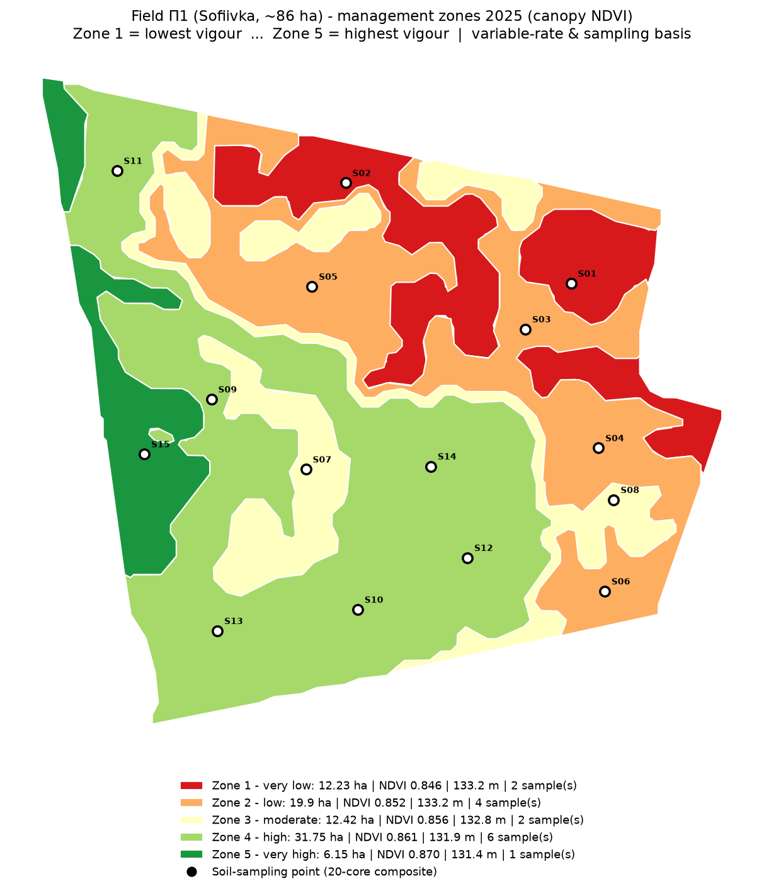
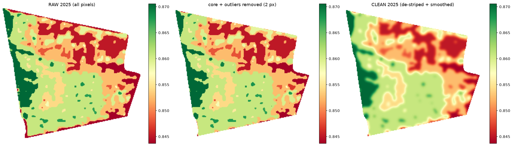
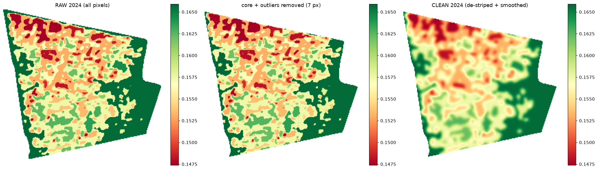
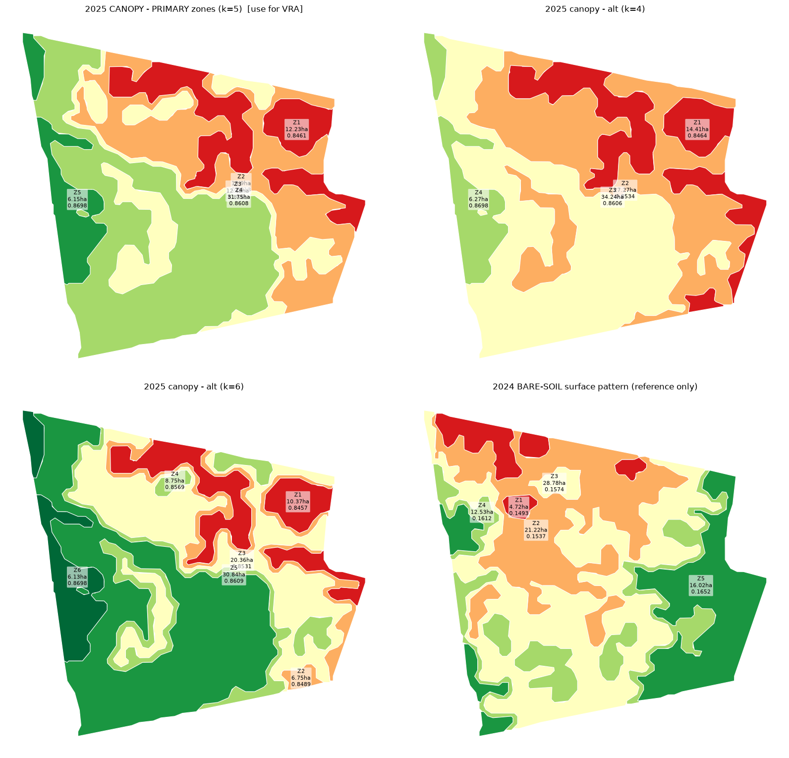
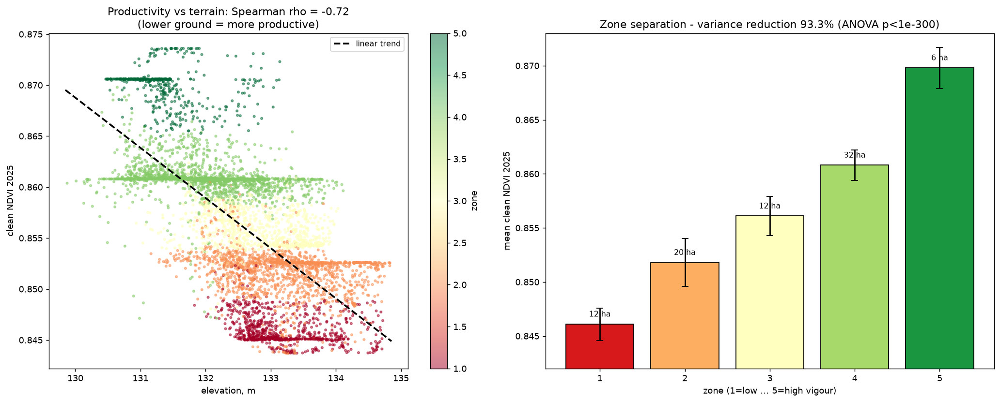
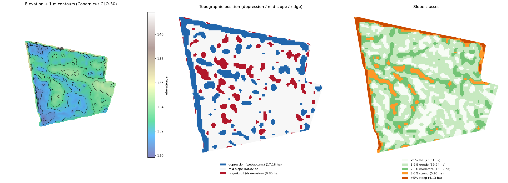

# Супутникове зонування поля П1 (Софіївка) для змінної норми внесення добрив

**Господарство:** Геворг ПОСП   **Поле:** П1   **Площа:** 86,05 га
**Розташування:** ~50.521° пн.ш., 31.594° сх.д. (Україна), UTM 36N / EPSG:32636
**Вхідні дані:** векторизований NDVI за 2024 та 2025 рр. (по одному знімку на рік)
**Дата звіту:** 2026-07-23

---

## 1. Головний висновок (коротко)

1. **Робочі зони продуктивності побудовано за знімком 2025 року** (повний покрив,
   NDVI ≈ 0.80–0.87) — це чистий, зв'язний малюнок вегетації, придатний для
   змінної норми добрив і відбору ґрунтових зразків. Рекомендований варіант — **5 зон**
   (є також варіанти на 4 та 6 зон).
2. **Знімок 2024 року — це «голий ґрунт»** (NDVI ≈ 0.15), а не вегетація. Його
   просторовий малюнок **статистично не збігається** з малюнком урожайності 2025 р.
   (кореляція Пірсона r = 0.04). Тому 2024 рік **не змішувався** з продуктивними
   зонами — він доданий окремо як довідковий шар «яскравості ґрунту».
3. **Зони підтверджені рельєфом.** Продуктивність 2025 р. сильно пов'язана з
   висотою (Спірмен ρ = **−0.72**): нижчі ділянки — продуктивніші, вищі — слабші.
   Це незалежне підтвердження, що зони відображають реальну, зумовлену рельєфом
   структуру поля, а не шум.
4. Карти рельєфу (горизонталі, класи висот, крутість схилів, топографічні позиції)
   побудовано за контуром поля з безкоштовної ЦМР **Copernicus GLO-30** і додано
   у форматі **shape**.



---

## 2. Що зроблено з «нерелевантними даними»

Завдання вимагало «максимально відкинути нерелевантні дані — можливі проходи техніки,
обробіток ґрунту — і виділити чистий малюнок розподілу вегетації». Виконано каскад
очищення (скрипт `scripts/step1_clean_ndvi.py`), однаковий для обох років, у проєкції
UTM 36N на сітці 5 м:

| Крок | Що прибирає | Як |
|------|-------------|-----|
| 1. Растеризація | — | NDVI-полігони → сітка 5 м |
| 2. Внутрішнє ядро | приграничні смуги, розворотні полоси (поворотні), крайовий ефект | ерозія контуру поля на **18 м** (86,05 → 79,2 га) |
| 3. Викиди (MAD) | дороги, локальні аномалії, залишки узбіч | відсічення значень далі **3.5·MAD** від медіани |
| 4. Медіанний фільтр 25 м | **колії/технологічні проходи техніки**, смугастість від обробітку | видаляє тонкі лінійні об'єкти, зберігаючи широкі зони |
| 5. Заповнення пропусків | — | найближчий сусід (для неперервності) |
| 6. Згладжування (Гаус σ=10 м) | «сіль-перець», дрібний шум поверхні | низькочастотний фільтр → чистий широкий малюнок |

Результат — гладкі, зв'язні поверхні NDVI без лінійних артефактів. Приклади «до/після»:



У знімку 2024 р. яскраві високі значення уздовж країв (трав'яні узбіччя / лісосмуги)
повністю прибрано ядром + фільтром викидів.



---

## 3. Чому 2024 рік не змішували з 2025

Це ключове агрономічне рішення, підтверджене цифрами:

* NDVI 2024 ≈ **0.15** — це рівень **голого/майже голого ґрунту**. Такий NDVI
  відображає не рослини, а **яскравість/вологість поверхні ґрунту** (побічно —
  органіку, гранскдад, пожнивні рештки), причому сильно залежить від погоди в день
  зйомки.
* NDVI 2025 ≈ **0.85** — **повний покрив**, тобто інтегральна сила культури =
  найкращий доступний показник реалізованої продуктивності.
* Просторова кореляція між роками: **Пірсон r = 0.04, Спірмен ρ = 0.08**
  (збіг терцилів 37% ≈ випадковий). Тобто малюнки **не пов'язані**.
* Перевірка рельєфом розставляє все на місця: NDVI 2025 ↔ висота = **−0.72**
  (сильний зв'язок), а NDVI 2024 ↔ висота = **+0.11** (зв'язку немає). Отже саме
  2025 р. несе стабільний, зумовлений ландшафтом сигнал продуктивності.

**Наслідок:** механічне усереднення двох шарів лише розмило б якісний сигнал 2025 р.
шумом. Тому зони будуються за 2025 р.; 2024 р. збережено окремо як довідку
(`shapefiles/zones/soil_2024.shp`).



---

## 4. Зони продуктивності 2025 (робочий шар)

Метод: кластеризація k-середніх по очищеному NDVI, впорядкування зон за зростанням
NDVI (Зона 1 — найслабша … Зона 5 — найсильніша), майоритарний фільтр +
відсів дрібних плям (< 0,5 га), згладжування меж (скрипт `scripts/step2_zoning.py`).
Оптимальне число зон за силуетним коефіцієнтом = 4–5 (0.68–0.70, «сильна» якість);
обрано **5** відповідно до побажання замовника.

| Зона | Рівень | Площа, га | % поля | NDVI сер. | Сер. висота, м | Точок відбору |
|:---:|--------|:---:|:---:|:---:|:---:|:---:|
| 1 | дуже низька | 12,23 | 14,8 | 0,846 | 133,2 | 2 |
| 2 | низька | 19,90 | 24,0 | 0,852 | 133,2 | 4 |
| 3 | середня | 12,42 | 14,8 | 0,856 | 132,8 | 2 |
| 4 | висока | 31,75 | 38,9 | 0,861 | 132,0 | 6 |
| 5 | дуже висока | 6,15 | 7,5 | 0,870 | 131,4 | 1 |

**Якість поділу:** індекс зменшення дисперсії **VR = 93,3 %** (внутрішньозонова
дисперсія — лише 6,7 % від загальнопольової), ANOVA F=112668, p < 10⁻³⁰⁰.
Зони статистично добре відокремлені.

> **Просторовий підпис.** Слабкі зони (1–2, червоно-помаранчеві) — це **північний
> схід і схід** поля (вищі позиції рельєфу). Сильні зони (4–5, зелені) — **захід і
> центр-південь** (нижчі позиції). Це стійкий, зрозумілий агрономічно градієнт.



**Важливо про величину контрасту.** При повному покриві NDVI «насичується», тому
абсолютна різниця між зонами невелика (0,846–0,870). Проте **просторовий малюнок**
надійний (підтверджений рельєфом і VR=93 %). Для точнішого кількісного контрасту в
майбутньому варто використати індекс **NDRE (red-edge)**, який не насичується у
щільному посіві.

---

## 5. Рельєф за контуром поля (формат shape)

Джерело: **Copernicus GLO-30 DEM** (ESA, ~30 м, безкоштовний, завантажено з
публічного відкритого бакета AWS, тайл N50/E031). Оброблено у UTM 36N,
передискретизовано до 10 м, обрізано за контуром поля (`scripts/step3_relief.py`).

* Висота поля: **129,8–141,8 м** (перепад ~12 м), схили переважно пологі
  (60 га — до 2 %).
* Поле **вище на пн.-сх./сх.** і **нижче на зх./пд.-зх.** — саме тому нижчі
  ділянки продуктивніші (більше вологи й дрібнозему).

Шейпфайли рельєфу (`shapefiles/relief/`):

| Файл | Вміст |
|------|-------|
| `relief_contours` | горизонталі через **1 м** (атрибут `elev_m`), 73 лінії |
| `relief_elevation_zones` | 5 класів висот (полігони) |
| `relief_slope_zones` | класи крутості: <1 / 1–2 / 2–3 / 3–5 / >5 % |
| `relief_tpi_zones` | топопозиція: пониження (волога/акумуляція) / схил / підвищення (сухо/ерозія) |



---

## 6. План відбору ґрунтових зразків (для калібрування норм)

Зони призначені керувати змінною нормою добрив і **прив'язаним до зон відбором**.
Побудовано **15 точок** відбору (`shapefiles/sampling/soil_sampling_points.shp`),
щільність ~**1 складений зразок на 5 га**, кожна точка — у представницькому «ядрі»
зони (зона стиснута на 25 м, щоб не потрапляти на межі/переходи).

Рекомендації до відбору:

* **Складений зразок** = **15–20 уколів** у радіусі ~20–30 м навколо точки, добре
  перемішати.
* **Глибина:** 0–30 см для P, K, pH, гумусу (за потреби 0–15 / 15–30 см окремо);
  додатково **30–60 см** для мінерального азоту (N-NO₃).
* Уникати аномалій (стежки, вимочки, купи), відбирати всередині зони.
* Кожен зразок підписаний ID (`S01…S15`) і прив'язаний до зони — лабораторні
  результати заносяться за зонами.

**Як зони перетворюються на карту внесення:**
1. За лабораторними даними по зонах будується потреба в елементі (кг/га) для кожної
   зони.
2. Зона + норма → полігональна карта-припис (VRA), яку читає термінал сівалки/
   розкидача (формати shp/ISO-XML).
3. Слабкі зони (1–2) — рішення залежно від стратегії: або «підтягнути» (більше
   добрив там, де ліміт — родючість), або економити (якщо ліміт — волога/рельєф і
   віддача низька). Це вирішується разом з агрономом за результатами аналізів.

---

## 7. Обмеження і рекомендації на майбутнє

* **Один знімок на рік — мало для «стабільних» зон.** Надійні багаторічні зони
  будують за **кількома знімками повного покриву** різних років/культур. Наявні
  зони 2025 р. — якісний старт (і вже підтверджені рельєфом), але бажано додати ще
  2–4 знімки піку вегетації.
* **2024 р. (голий ґрунт)** краще замінити на цілеспрямований **композит голого
  ґрунту** або дані **ECa/EM-38**, якщо потрібен шар ґрунту.
* **NDRE замість NDVI** для щільних посівів — більший контраст.
* Зони варто **валідувати за фактичною урожайністю** (дані комбайна), коли з'являться.

---

## 8. Структура файлів

```
Sofiivka_P1_zoning/
├── report/            ЗВІТ_зонування_П1_Софіївка.md (цей файл), zone_stats.csv, validation.json
├── shapefiles/
│   ├── boundary/      field_boundary, analysis_core            (+ _wgs84)
│   ├── zones/         zones_2025 (робочий, 5 зон),
│   │                  zones_2025_k4, zones_2025_k6 (варіанти),
│   │                  soil_2024 (довідковий шар голого ґрунту)  (+ _wgs84)
│   ├── relief/        relief_contours, relief_elevation_zones,
│   │                  relief_slope_zones, relief_tpi_zones      (+ _wgs84)
│   └── sampling/      soil_sampling_points                      (+ _wgs84)
├── rasters/           ndvi_2024_clean.tif, ndvi_2025_clean.tif, dem_field_10m.tif
├── figures/           00…06 (PNG-карти цього звіту)
└── scripts/           geo_common.py, step1…step5 (відтворюваний конвеєр)
```

Кожен шейпфайл продубльовано у двох системах координат:
* без суфікса — **UTM 36N (EPSG:32636)**, метри (для розрахунків площ/норм);
* `_wgs84` — **EPSG:4326** (для веб-карт і більшості агроплатформ).

Усі атрибути — латиницею (сумісність з GIS): `zone`, `ndvi_mean`, `area_ha`,
`elev_m`, `slope_cls`, `sample_id` тощо.

---

## 9. Відтворюваність

Увесь конвеєр — у `scripts/` (Python: geopandas, rasterio, scikit-learn, scipy).
Запуск по порядку: `step1_clean_ndvi.py → step2_zoning.py → step3_relief.py →
step4_sampling.py → step5_figures.py`. Параметри (розмір ядра, фільтри, число зон,
щільність відбору) винесено у верх скриптів і легко змінюються.
