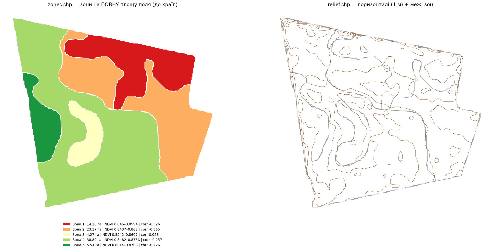

# Шаблон: супутникові знімки → зони + рельєф

Багаторазовий конвеєр: із супутникового **NDVI** одного поля робить **рівно два
шейпфайли** — зони продуктивності та рельєф. Розроблено на прикладі поля П1
(Софіївка), придатне для будь-якого поля.



## Вихід (рівно 2 файли)
| Файл | Що | Атрибути |
|------|----|----------|
| **`zones.shp`** | зони продуктивності, покривають **повну площу поля** до країв | `zone_id` (1=найслабша…N=найсильніша), `veg_min`, `veg_max`, `veg_mean` (NDVI), `area_ha`, `corr_elev` (кореляція NDVI↔висота в зоні) |
| **`relief.shp`** | рельєф поля | `elev_m` (горизонталі, крок 1 м) — або класи висот, див. `RELIEF_TYPE` |

Поряд кладуться `.qml` (стилі QGIS) — відкрив `.shp`, одразу бачиш кольори.

## Як користуватись
1. Відкрий `run_zoning.py`, у блоці **CONFIG** впиши шляхи:
   ```python
   INPUT_NDVI    = "шлях/до/ndvi.shp"   # NDVI-полігони (атрибут NDVI)
   FIELD_CONTOUR = "шлях/до/field.shp"  # контур поля; None = взяти обвід NDVI
   OUT_DIR       = "output"
   N_ZONES       = 5                    # 4..6
   SMOOTH_LEVEL  = "C"                  # A точно · C рекомендовано · D сильно згладжено
   RELIEF_TYPE   = "contours"           # або "elevation_zones"
   ```
2. Запусти:
   ```bash
   pip install geopandas rasterio scikit-learn scipy shapely
   python run_zoning.py
   ```
3. Забери `OUT_DIR/zones.shp` і `OUT_DIR/relief.shp`.

## Що робить конвеєр (стисло)
1. читає NDVI, переводить у метричну проєкцію UTM (визначає зону автоматично);
2. будує контур поля (з `FIELD_CONTOUR` або з обводу NDVI);
3. **аналіз на «продуктивному ядрі»** (поле, стягнуте на `EDGE_BUFFER_M`=18 м) —
   так відкидаються крайовий ефект, розворотні смуги, узбіччя, проходи техніки
   (медіанний фільтр) та викиди (MAD);
4. кластеризація за малюнком NDVI → впорядкування зон за силою вегетації →
   прибирання тонких «відростків» і злиття шматків < `MIN_FRAC` площі
   (компактні, придатні для техніки зони);
5. **розтягування зон на повний контур поля** — кожен крайовий піксель дістає
   найближчу зону, тож `zones.shp` покриває всю площу, яку ви дали;
6. рельєф — з безкоштовної ЦМР **Copernicus GLO-30** (ESA, ~30 м) за контуром
   (автозавантаження; або вкажіть локальний DEM у `DEM_PATH`).

## Рівні згладжування
`A` — максимально точно (повторює малюнок NDVI) · `B` — легко · **`C` —
рекомендовано** (баланс точність/простота) · `D` — сильно (прості блоки).

## Приклад
`output_P1_example/` — готовий результат для поля П1 (86 га): `zones.shp` (5 зон,
повне поле) + `relief.shp` (горизонталі 1 м), у WGS84 (EPSG:4326).

## Примітки
- Вихідна CRS — `OUT_CRS` (за замовч. **WGS84**); площі рахуються у метричній
  UTM і зберігаються в `area_ha`.
- `corr_elev` — коефіцієнт Пірсона NDVI↔висота в межах зони: наскільки
  продуктивність зони пояснюється рельєфом (від'ємний = нижче за рельєфом ⇒
  сильніша вегетація — типово для цього поля).
- Для рельєфу потрібен інтернет (або локальний `DEM_PATH`).
